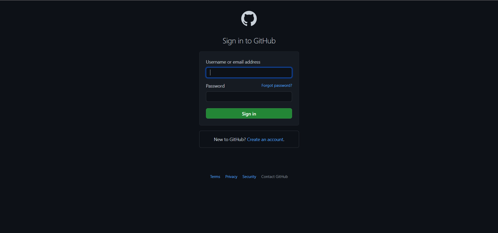
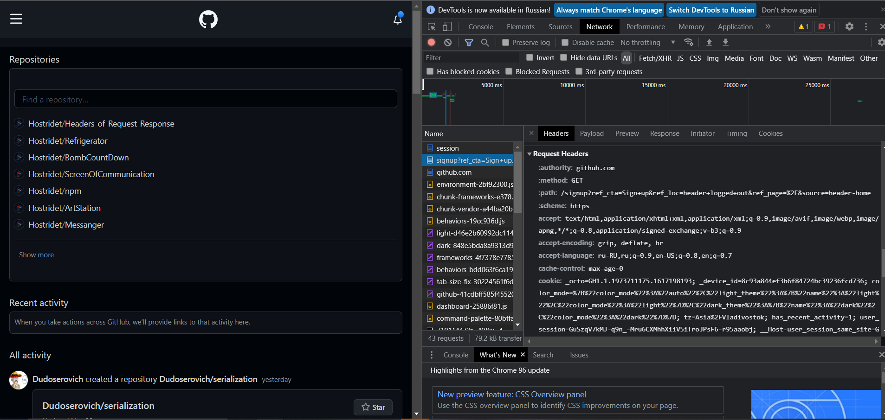
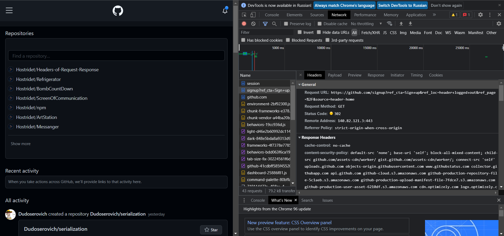
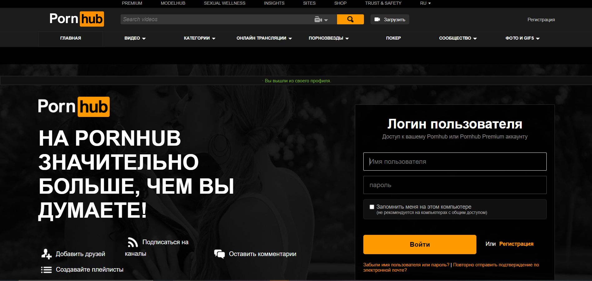
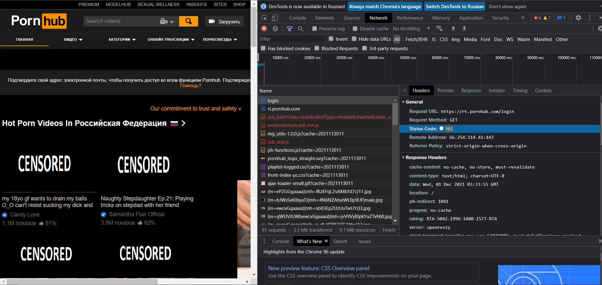
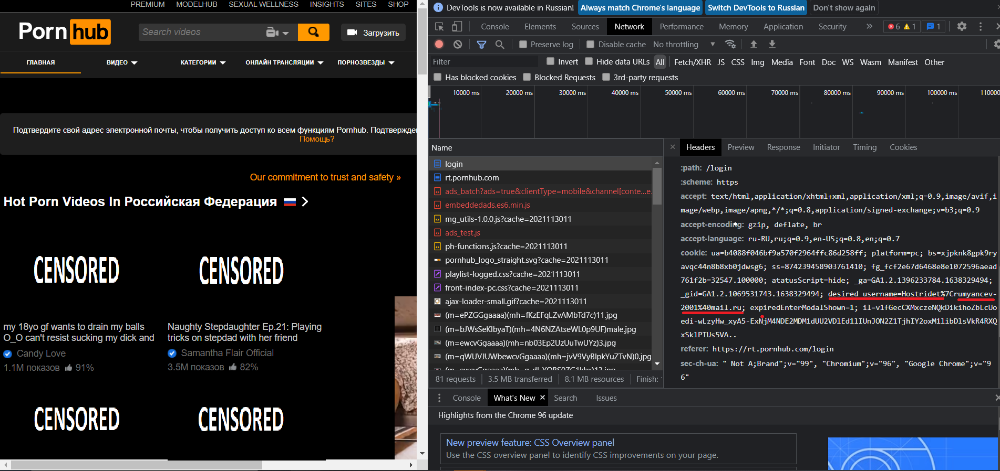

# 2-Socials-Authentication

Короче, меченый, я проверил пару сайтов и в благородство играть не буду.  

## github.com
Для начала решил проверить авторизацию на моем любимом файлообменике, но всё же скайп лучше.  
Был получен статус код: 302, значит меня перенаправили куда-то.  
 

  
К огромному сожалению, мои личные данные не были найдены (фсб, привет), скорее всего, они заКЕКшированны. 

...

## pornhub.com
Решил проверить любимый сайт нашего старосты (он часто рекомендует его)   

  
Мои логин и почты были обнаружены (фсб, теперь рады?)

